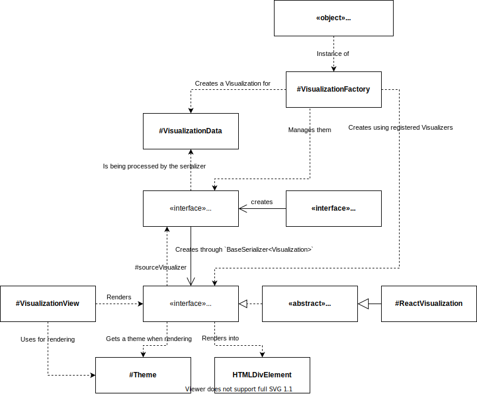

# Visualization Core

## Installation

You can use yarn to install this library:

```
yarn add @hediet/visualization-core
```

You may want to install `@hediet/visualization-bundle` for the actual visualizations too!

## Usage

Use `globalVisualizationFactory` to visualize some data:

```tsx
import { globalVisualizationFactory } from "@hediet/visualization-core";

const data = {
	kind: { graph: true as true },
	nodes: [
		{ id: "1", label: "1" },
		{ id: "2", label: "2", color: "orange" },
		{ id: "3", label: "3" },
	],
	edges: [
		{ from: "1", to: "2", color: "red" },
		{ from: "1", to: "3" },
	],
};

const visualizations = globalVisualizationFactory.getVisualizations(
	data,
	/* preferred visualization id */ undefined
);
// `visualizations.bestVisualization` is the visualization that is best suited to visualize the data.
// `visualiztaions.allVisualizations` contains all suitable visualizations.
```

If you use react, you can use the `VisualizationView` component to render a visualization:

```tsx
import { VisualizationView, Theme } from "@hediet/visualization-core";

// const visualizations = ...

function App() {
	if (!visualizations.bestVisualization) {
		return null;
	}
	return (
		<VisualizationView
			theme={Theme.light}
			visualization={visualizations.bestVisualization}
		/>
	);
}
```

## Architecture


